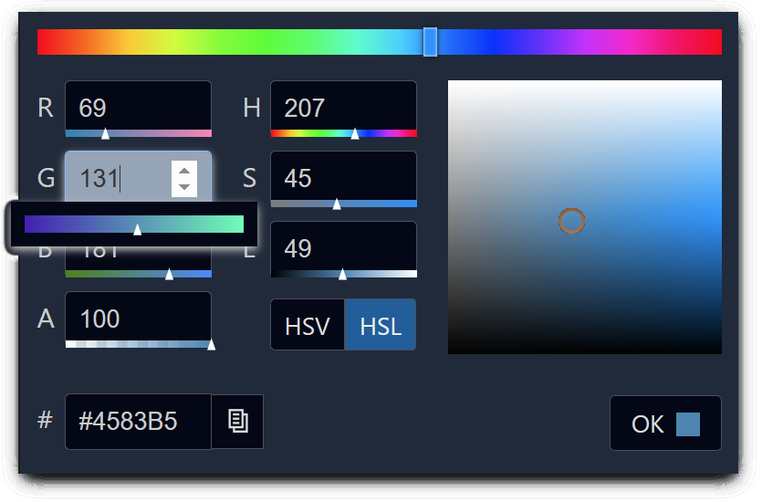

# \<color-picker>


A weekend ramp up project to learn LIT basics. Maybe I can turn this into a shared npm if I can finish/polish (WCAG, best practices, etc.)

## Installation

```bash
npm i color-picker
```

## Usage

```html
<script type="module">
  import 'color-picker/color-picker.js';
</script>

<color-picker value=`any-color-string`></color-picker>
```

## Events
Fires a 'color-picked' event with a color object in the event detail 

## Local Demo with `web-dev-server`

```bash
npm start
```

To run a local development server that serves the basic demo located in `demo/index.html`
